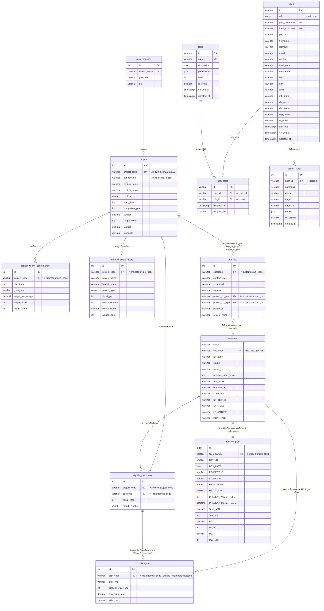

# รายละเอียดโครงสร้างตารางและความสัมพันธ์ของฐานข้อมูล (Database Schema & Relationships)

เอกสารนี้จัดทำขึ้นเพื่อบันทึกโครงสร้างฐานข้อมูล ความสัมพันธ์ของแต่ละตาราง และขั้นตอนการประมวลผลข้อมูลในระบบ เพื่อให้ผู้พัฒนาหรือผู้ดูแลระบบสามารถอ้างอิงและดำเนินการแก้ไขข้อมูลต่อได้ทันทีแม้ไม่ได้เชื่อมต่อกับผู้ช่วย AI

---

## 1. ข้อมูลฐานข้อมูลทั่วไป (Database Configuration)
* **ชื่อฐานข้อมูลหลัก:** `pcis`
* **ตัวละครหลักที่ใช้ (Charset & Collation):** `utf8mb4` คอลเลชัน `utf8mb4_unicode_ci` (เพื่อรองรับการค้นหาอักษรภาษาไทยที่ถูกต้องและหลีกเลี่ยงข้อผิดพลาด Collation Mismatch)
* **ระบบจัดการฐานข้อมูล:** MySQL / MariaDB

---

## 2. โครงสร้างแต่ละตาราง (Table Definitions)

### 2.1. ตาราง `pwa_branches` (ตารางสาขาการประปาส่วนภูมิภาค)
ใช้เก็บรายชื่อสาขาและจังหวัดของ กปภ. ขต.6
* **id** (`int`, Primary Key, Auto Increment): ไอดีประจำสาขา
* **branch_name** (`varchar(100)`, Unique): ชื่อสาขา (เช่น 'ขอนแก่น', 'บ้านไผ่')
* **province** (`varchar(100)`): จังหวัดที่สาขานั้นตั้งอยู่
* **ba** (`varchar(10)`): รหัส Business Area (BA) ของสาขา (เช่น '10601' สำหรับขอนแก่น)

### 2.2. ตาราง `projects` (ตารางโครงการขยายเขต/วางท่อ)
เก็บข้อมูลรายละเอียดหัวโครงการหลักที่ดึงมาจากแผนแม่บทหรือป้อนเข้าใหม่
* **id** (`int`, Primary Key, Auto Increment): ไอดีแถว
* **project_code** (`varchar(50)`, Unique): รหัสโครงการหลัก (เช่น `1Z.68.2943.2.1.5.00`)
* **contract_no** (`varchar(100)`): เลขที่สัญญาของโครงการ (เช่น `กปภ.ข.6/178/2568` หรือ `กปภ.ข.6-01/2564`)
* **branch_name** (`varchar(100)`): ชื่อสาขาที่รับผิดชอบโครงการ
* **project_name** (`varchar(255)`): ชื่อโครงการขยายเขต
* **project_type** (`tinyint`): ประเภทโครงการ
  * `1` = เงินรายได้ (เดิมคือ งบลงทุน)
  * `2` = เงินอุดหนุน (เดิมคือ งบอุดหนุน)
  * `3` = กระตุ้นเศรษฐกิจ (เดิมคือ งบกระตุ้นเศรษฐกิจ)
  * `4` = วางท่อเข้าซอย
* **start_year** (`int`): ปีที่เริ่มโครงการ (พ.ศ.)
* **completion_year** (`int`): ปีที่โครงการแล้วเสร็จ (พ.ศ.)
* **budget** (`decimal(15,2)`): งบประมาณโครงการ
* **target_users** (`int`): เป้าหมายจำนวนผู้ใช้น้ำ (ราย)
* **latitude** (`decimal(10,7)`): พิกัดละติจูดของโครงการ (คำนวณจากค่าเฉลี่ยพิกัดผู้ใช้น้ำ)
* **longitude** (`decimal(10,7)`): พิกัดลองจิจูดของโครงการ (คำนวณจากค่าเฉลี่ยพิกัดผู้ใช้น้ำ)

### 2.3. ตาราง `project_yearly_performance` (ตารางเป้าหมายและผลสัมฤทธิ์รายปีสะสม)
เก็บเป้าหมายรายปีสะสม และจำนวนการติดตั้งใช้งานจริงของผู้ใช้น้ำในแต่ละปีประเมิน
* **id** (`int`, Primary Key, Auto Increment): ไอดีแถว
* **project_code** (`varchar(50)`): รหัสโครงการ (เชื่อมไปยัง `projects.project_code`)
* **fiscal_year** (`int`): ปีงบประมาณการประเมิน (พ.ศ.)
* **year_type** (`varchar(20)`): ลำดับปีที่ประเมินโครงการ (`completion_year` (ปีที่แล้วเสร็จ), `year_1` (ปีที่ 1), `year_2`, `year_3`, `year_4`, `year_5_plus`)
* **target_percentage** (`decimal(5,2)`): เปอร์เซ็นต์เป้าหมายสะสมในปีนั้นๆ
  * *โครงการประเภท 1-3:* ปีที่ 0 = 40%, ปีที่ 1 = 0%, ปีที่ 2-5 = ปีละ 15%
  * *โครงการประเภท 4:* ปีที่ 0 = 100%
* **target_users** (`int`): เป้าหมายผู้ใช้น้ำสะสมในปีงบประมาณนั้นๆ (คำนวณตามสัดส่วน %)
* **actual_users** (`int`): จำนวนผู้ใช้น้ำที่เกิดขึ้นจริงในปีงบประมาณนั้น (นับจำนวนการเชื่อมสายท่อจริง)

### 2.4. ตาราง `monthly_actual_users` (ตารางรายงานผู้ใช้น้ำจริงแยกรายเดือน)
เก็บข้อมูลจำนวนผู้ใช้น้ำจริงที่เพิ่มขึ้นในแต่ละเดือนของโครงการแต่ละโครงการ
* **id** (`int`, Primary Key, Auto Increment): ไอดีแถว
* **project_code** (`varchar(50)`): รหัสโครงการ (เชื่อมไปยัง `projects.project_code`)
* **project_name** (`varchar(255)`): ชื่อโครงการ
* **branch_name** (`varchar(100)`): ชื่อสาขาที่ดูแล
* **project_type** (`tinyint`): ประเภทโครงการ (1, 2, 3, 4)
* **fiscal_year** (`int`): ปีงบประมาณ (พ.ศ.)
* **month_number** (`tinyint`): ลำดับเดือนที่ผู้ใช้น้ำเกิด (1-12)
* **month_name** (`varchar(20)`): ชื่อย่อเดือนในภาษาไทย (เช่น 'ม.ค.', 'ก.พ.')
* **actual_users** (`int`): จำนวนผู้ใช้น้ำที่ลงทะเบียนเพิ่มขึ้นในเดือนและปีนั้น

### 2.5. ตาราง `customer` (ตารางโปรไฟล์หลักของผู้ใช้น้ำจากระบบ PCIS)
เก็บรายละเอียดข้อมูลส่วนบุคคลและข้อมูลผู้ใช้น้ำ
* **cus_id** (`varchar(20)`): รหัส ID ภายใน
* **cus_code** (`varchar(20)`, Index): รหัสผู้ใช้น้ำประจำตัว (เช่น `10601638736`)
* **fullName** (`varchar(100)`): ชื่อ-นามสกุลของผู้ใช้น้ำ
* **status** (`varchar(1)`): สถานะมาตรวัดน้ำ
* **meter_no** (`varchar(50)`): หมายเลขมาตรวัดน้ำ
* **present_meter_count** (`int`): ตัวเลขการใช้มาตรน้ำปัจจุบัน
* **use_Name** (`varchar(500)`): ประเภท/ลักษณะการใช้น้ำ
* **brandName** (`varchar(50)`): ยี่ห้อมาตรวัด
* **sizeName** (`varchar(10)`): ขนาดมาตรวัดน้ำ (เช่น 1/2 นิ้ว)
* **full_address** (`varchar(500)`): ที่อยู่เต็มของผู้ใช้น้ำ
* **LATITUDE** (`varchar(20)`): พิกัดจุดผู้ใช้น้ำ (ละติจูด)
* **LONGITUDE** (`varchar(20)`): พิกัดจุดผู้ใช้น้ำ (ลองจิจูด)
* **BGN_DATE** (`varchar(50)` / `date`): วันที่เริ่มต้นติดตั้งและใช้น้ำจริง (ปี ค.ศ.)

### 2.6. ตาราง `proj_cus` (ตารางจับคู่ระหว่างผู้ใช้น้ำกับสัญญาโครงการ)
เชื่อมโยงรหัสผู้ใช้น้ำแต่ละคนว่าเกิดขึ้นจากสัญญาโครงการตัวใด
* **Id** (`int`, Primary Key, Auto Increment): ไอดีแถว
* **custcode** (`varchar(50)`): รหัสผู้ใช้น้ำ (เชื่อมกับ `customer.cus_code`)
* **contrac_date** (`varchar(10)`): วันที่เซ็นสัญญาติดตั้งมาตรวัด (ในรูปแบบ ดด/ปป/ปปปป)
* **yearinstall** (`varchar(5)`): ปีงบประมาณที่เข้าติดตั้ง (พ.ศ.)
* **meterno** (`varchar(20)`): เลขมาตรวัดน้ำ
* **project_no_proj** (`varchar(100)`): เลขที่สัญญาของโครงการหลักที่ผู้ใช้น้ำติดตั้ง (เชื่อมกับ `projects.contract_no`)
* **project_no_pipe** (`varchar(100)`): เลขที่สัญญาโครงการวางท่อเข้าซอย (เชื่อมกับ `projects.contract_no` เพิ่มเติม)
* **bgncustdt** (`varchar(6)`): วันที่ติดตั้งใช้น้ำสะสมในรูปแบบตัวเลข YYMMDD (เช่น 671015 เป็นข้อมูลสำรอง)
* **project_name** (`varchar(500)`): ชื่อโครงการขยายเขต

### 2.7. ตาราง `plan_master` (ตารางแม่แบบการนำเข้าแผนงานหลัก)
ตารางดิบที่นำเข้าเพื่อใช้สำหรับดึงโครงการเข้ามาสร้างลงตาราง `projects`
* **proj_no** -> เชื่อมไปยัง `projects.project_code`
* **contract_no** -> เชื่อมไปยัง `projects.contract_no`
* **branch** -> เชื่อมไปยัง `projects.branch_name`

### 2.8. ตาราง `eligible_customers` (ตารางสรุปรายชื่อผู้ใช้น้ำที่ผ่านเกณฑ์ของโครงการ)
ใช้เก็บรายชื่อผู้ใช้น้ำจริงที่ผ่านเกณฑ์การประเมินเพื่อนำไปแสดงผลและวิเคราะห์ประสิทธิภาพ
* **id** (`int`, Primary Key, Auto Increment): ไอดีแถว
* **project_code** (`varchar(50)`): รหัสโครงการหลัก (เชื่อมไปยัง `projects.project_code`)
* **custcode** (`varchar(50)`): รหัสผู้ใช้น้ำ (เชื่อมไปยัง `customer.cus_code`)
* **fiscal_year** (`int`): ปีงบประมาณที่เข้าใช้น้ำจริง (พ.ศ.)
* **month_number** (`tinyint`): ลำดับเดือนที่เกิดยอดการติดตั้งใช้น้ำจริง (1-12)

### 2.9. ตาราง `users` (ตารางข้อมูลผู้ใช้งานระบบ)
ใช้เก็บข้อมูลและประวัติการเข้าใช้งานของบุคลากรภายในระบบ
* **id** (`varchar(36)`, Primary Key): ไอดีผู้ใช้งาน (UUID)
* **role** (`enum('admin', 'user')`): บทบาทสิทธิ์หลักของระบบงาน
* **pwa_username** (`varchar(100)`): ชื่อเข้าใช้งานระบบแบบบูรณาการของ กปภ. (AD/PWA)
* **local_username** (`varchar(100)`): ชื่อเข้าใช้งานระบบแบบทั่วไป
* **password** (`varchar(255)`): รหัสผ่านที่เข้ารหัสความปลอดภัย (bcrypt)
* **firstname** / **lastname** (`varchar(100)`): ชื่อ-นามสกุลจริง
* **email** / **position** (`varchar(255)`): อีเมลและตำแหน่งงาน
* **level_name** / **costcenter** (`varchar(100)`): ระดับตำแหน่งและรหัสศูนย์ต้นทุน
* **ba** (`varchar(20)`): รหัส Business Area (BA)
* **part** / **area** (`varchar(100)`): ส่วนงาน/สาขาที่รับผิดชอบ
* **job_name** / **div_name** / **dep_name** / **org_name** (`varchar(255)`): ชื่อตำแหน่งงานย่อย ฝ่าย แผนก และองค์กร
* **is_active** (`boolean`): สถานะการเปิดใช้งานบัญชี
* **last_login** (`timestamp`): วันเวลาเข้าสู่ระบบล่าสุด
* **created_at** / **updated_at** (`timestamp`): วันเวลาสร้างและแก้ไขข้อมูลล่าสุด

### 2.10. ตาราง `roles` (ตารางบทบาทหน้าที่และสิทธิ์การเข้าถึง)
ใช้ระบุขอบเขตและระดับการเข้าใช้งานคุณสมบัติต่าง ๆ
* **id** (`varchar(36)`, Primary Key): ไอดีบทบาท (UUID)
* **name** (`varchar(100)`): ชื่อบทบาท (เช่น `admin`, `user`)
* **description** (`text`): รายละเอียดหน้าที่ของสิทธิ์
* **permissions** (`json`): รายการสิทธิ์การทำงานย่อย (เช่นการจัดการข้อมูลดิบ)
* **level** (`int`): ลำดับความสำคัญในการทำงานระบบ
* **is_active** (`boolean`): สถานะการเปิดสิทธิ์ทำงาน
* **created_at** / **updated_at** (`timestamp`): วันเวลาบันทึกและแก้ไขระบบ

### 2.11. ตาราง `user_roles` (ตารางเชื่อมโยงสิทธิ์การใช้งานของผู้ใช้)
เชื่อมโยงเพื่อจัดสรรสิทธิ์ตามระบบงานรายบุคคล
* **id** (`varchar(36)`, Primary Key): ไอดีแถว (UUID)
* **user_id** (`varchar(36)`): รหัสผู้ใช้งาน (เชื่อมไปยัง `users.id`)
* **role_id** (`varchar(36)`): รหัสบทบาทใช้งาน (เชื่อมไปยัง `roles.id`)
* **assigned_at** (`timestamp`): วันเวลาจัดตั้งสิทธิ์
* **assigned_by** (`varchar(36)`): ไอดีของผู้ใช้ที่เป็นคนมอบหมายสิทธิ์

### 2.12. ตาราง `system_logs` (ตารางประวัติกิจกรรมและ Log การเข้าใช้งาน)
บันทึกประวัติการกระทำเพื่อความปลอดภัยและการตรวจสอบระบบย้อนหลัง
* **id** (`int`, Primary Key, Auto Increment): ไอดี Log
* **user_id** (`varchar(36)`): ไอดีของผู้ทำกิจกรรม (เชื่อมไปยัง `users.id`)
* **username** (`varchar(100)`): ชื่อผู้ใช้งานที่เข้าระบบขณะนั้น
* **action** (`varchar(50)`): กิจกรรมที่ทำ (เช่น `LOGIN`, `UPDATE_PROJECT`)
* **target** / **target_id** (`varchar(50)` / `varchar(100)`): ตาราง/เป้าหมาย และไอดีของเป้าหมายที่ถูกกระทำ
* **details** (`json`): รายละเอียดการทำงานเพิ่มเติม
* **ip_address** (`varchar(45)`): หมายเลขไอพีของผู้ใช้งาน
* **created_at** (`timestamp`): วันเวลาบันทึก Log กิจกรรม

### 2.13. ตาราง `debt_trn` (ตารางบันทึกการใช้น้ำและหนี้ค้างชำระรายเดือนของผู้ใช้น้ำจากระบบ PCIS)
ใช้เก็บรายละเอียดประวัติการใช้น้ำและบิลค่าน้ำรายเดือนของลูกค้าแต่ละราย
* **id** (`int`, Primary Key): ไอดีอ้างอิงของหนี้
* **cust_code** (`varchar(50)`): รหัสผู้ใช้น้ำ (เชื่อมกับ `customer.cus_code` หรือ `eligible_customers.custcode`)
* **debt_ym** (`varchar(20)`): ปีและเดือนที่บันทึกบิล/หนี้ ในรูปแบบ พ.ศ. (เช่น 256812 สำหรับเดือนธันวาคม 2568)
* **present_water_usg** (`int`): ปริมาณน้ำประปาที่ใช้งานจริงในรอบบิลนั้น (ลูกบาศก์เมตร)
* **total_water_amt** (`decimal(18,6)`): จำนวนเงินค่าน้ำค้างชำระในรอบบิล (บาท)
* **paid_ym** (`varchar(20)`): ปีและเดือนที่มีการชำระเงินค่าหนี้นั้น

### 2.14. ตาราง `debt_trn_pivot` (ตาราง Pivot สรุปประวัติปริมาณการใช้น้ำและยอดเงินสะสม)
ตารางโครงสร้างพิเศษที่ทำการสรุปยอดใช้น้ำและยอดบิลสะสมย้อนหลังแยกรายเดือน (M0 ถึง M12) สำหรับวิเคราะห์แนวโน้มลูกค้าแต่ละราย
* **id** (`bigint`): ไอดีอ้างอิง
* **CUS_CODE** (`varchar(20)`): รหัสผู้ใช้น้ำประจำตัว (เชื่อมกับ `customer.cus_code`)
* **STATUS** (`varchar(5)`): สถานะมาตรปัจจุบัน
* **BGN_DATE** (`date`): วันที่เริ่มต้นใช้น้ำจากการประปา
* **PROJECTNO** (`varchar(200)`): รหัสสัญญาโครงการที่ผู้ใช้น้ำสังกัด
* **SIZENAME** / **BRANDNAME** / **METER_NO** (`varchar`): ขนาดมาตร ยี่ห้อ และเลขมาตรวัดน้ำ
* **PRESENT_WATER_USG** / **PRESENT_METER_DATE**: เลขมาตรและวันเวลาที่บันทึกหน่วยล่าสุด
* **SUM_AMT** (`decimal(18,6)`): ยอดเงินค่าน้ำค้างชำระรวมสะสมทั้งหมด
* **sum_usg** (`int`): ปริมาณการใช้น้ำสะสมรวมทั้งหมด
* **M0** ถึง **M12** (`decimal(18,6)`): ยอดเงินค้างชำระย้อนหลังแยกรายเดือน (M0 = เดือนปัจจุบัน, M1 ย้อนหลัง 1 เดือน...)
* **M0_usg** ถึง **M12_usg** (`int`): ปริมาณน้ำที่ใช้ย้อนหลังแยกรายเดือน (M0_usg = เดือนปัจจุบัน, M1_usg ย้อนหลัง 1 เดือน...)

---

## 3. แผนภาพความสัมพันธ์และการเชื่อมต่อข้อมูล (Database Entity Relationships)



---

## 4. ข้อสังเกตเชิงลึกเกี่ยวกับการดึงข้อมูล (Queries and Joins)

### 4.1. การดึงข้อมูลผู้ใช้น้ำของแต่ละโครงการ
การทำงานของ API Endpoint: `/api/project-customers/:project_code`
ระบบจะใช้คิวรีที่ทำการเชื่อมข้อมูล `proj_cus` เข้ากับ `customer` และกรองด้วย `project_code` ดังนี้:

```sql
SELECT 
  pc.custcode AS cus_code, 
  COALESCE(c.fullName, 'ไม่พบรายชื่อในฐานข้อมูล') AS fullName, 
  c.LATITUDE, 
  c.LONGITUDE, 
  COALESCE(c.full_address, 'ไม่พบที่อยู่ในฐานข้อมูล') AS full_address,
  COALESCE(c.meter_no, pc.meterno) AS meter_no,
  COALESCE(c.use_Name, '-') AS use_Name,
  COALESCE(c.brandName, '-') AS brandName,
  COALESCE(c.sizeName, '-') AS sizeName,
  COALESCE(c.present_meter_count, 0) AS present_meter_count,
  COALESCE(c.status, '-') AS status
FROM proj_cus pc
LEFT JOIN customer c ON CONVERT(pc.custcode USING utf8mb4) COLLATE utf8mb4_unicode_ci = c.cus_code
JOIN projects p ON TRIM(CONVERT(pc.project_no_proj USING utf8mb4)) COLLATE utf8mb4_unicode_ci = TRIM(p.contract_no)
WHERE p.project_code = ?;
```

---

## 5. การจัดการปัญหาข้อมูลไม่แสดงผล (Data Inconsistency / Missing Users)

### 5.1. ปัญหารายชื่อผู้ใช้น้ำในสัญญาปี 2568 ไม่แสดงผล
* **สาเหตุ:** ข้อมูลผู้ใช้น้ำรายใหม่ ๆ ได้ถูกบันทึกลงในตาราง `proj_cus` แล้วเพื่อเชื่อมโยงกับโครงการ (เช่น โครงการสัญญา 178/2568 มีจำนวน 93 ราย) แต่รายชื่อและที่อยู่ของผู้ใช้น้ำเหล่านั้น**ยังไม่ได้เพิ่มเข้าไปในตาราง `customer`** 
* **จุดสังเกต:**
  * ข้อมูลรหัสผู้ใช้น้ำล่าสุดในตาราง `customer` สิ้นสุดอยู่ที่ `10601638437`
  * แต่ข้อมูลผู้ใช้น้ำของโครงการในปี 2568 ในตาราง `proj_cus` มีรหัสวิ่งไปจนถึง `10601646966`
  * รหัสที่หายไปทั้งหมด (เช่น `10601638736` หรือรหัสที่สูงกว่า `10601638437`) จะแสดงผลเป็น **"ไม่พบรายชื่อในฐานข้อมูล"**

### 5.2. แนวทางการแก้ไขเมื่อได้รับข้อมูลอัปเดต
เมื่อได้รับตารางผู้ใช้น้ำล่าสุดจากระบบ PCIS (เช่น ไฟล์ SQL Dump ตาราง `customer` ล่าสุด):
1. นำข้อมูลไปอัปเดตลงตาราง `customer` โดยการ Import ไฟล์ SQL เพิ่มเติม หรือดำเนินการผ่านคำสั่ง SQL INSERT/REPLACE เพื่อนำรหัสผู้ใช้น้ำที่ขาดหายเข้าไปในระบบ
2. หลังจากนำเข้าแล้ว ให้ทำการรันสคริปต์คำนวณพิกัดโครงการและผลการดำเนินงานใหม่ โดยรันคำสั่ง:
   ```bash
   cd backend
   node update_data.js
   ```
   *หมายเหตุ: คำสั่งนี้จะทำการดึงพิกัดเฉลี่ยของผู้ใช้น้ำแต่ละรายที่อยู่ในโครงการนั้น ๆ มาอัปเดตลงฟิลด์ `latitude` และ `longitude` ของตาราง `projects` ใหม่อัตโนมัติ พร้อมอัปเดตตัวเลขผลสัมฤทธิ์ในตารางประสิทธิภาพ*

---

## 6. ลำดับการประมวลผลและการอัปเดตระบบหากมีการเปลี่ยนแปลงโครงสร้าง
1. หากมีการเพิ่มคอลัมน์ใหม่ในตาราง `projects` หรือตารางผลการดำเนินงาน ให้ตรวจสอบและอัปเดตโครงสร้าง DDL ในไฟล์ `backend/seed.js`, `backend/migrate.js` และ `backend/update_data.js` 
2. ตัวแปรสภาพแวดล้อมที่ตั้งค่าสำหรับการเชื่อมโยงฐานข้อมูลหลักจะกำหนดอยู่ในไฟล์ `backend/.env` ในหัวข้อ:
   * `DB_HOST`
   * `DB_PORT`
   * `DB_USER`
   * `DB_PASSWORD`
   * `DB_DATABASE` (ปัจจุบันกำหนดเป็น `pcis`)

---

## 7. ผลกระทบเมื่อมีการอัปเดตข้อมูลในตารางดิบ (Data Update Impacts)

ในระบบนี้มีตารางกลุ่มที่เป็นข้อมูลดิบ (Raw Data) ซึ่งถ้านำเข้าหรืออัปเดตข้อมูลใหม่ จะส่งผลกระทบต่อเนื่องไปยังตารางแสดงผลอื่นๆ (Dashboard Tables) โดยมีรายละเอียดดังนี้:

### 7.1. ตาราง `plan_master` (ตารางแผนงานหลัก)
ตารางนี้เป็นหัวใจหลักของข้อมูลโครงการทั้งหมด หากอัปเดตจะส่งผลกระทบต่อ:
* **ตาราง `projects`**: ข้อมูลรายละเอียดโครงการ เช่น ชื่อโครงการ, งบประมาณ, เป้าหมายผู้ใช้น้ำ (Target), ประเภทโครงการ, ปีที่เริ่มและแล้วเสร็จ จะถูกนำข้อมูลใหม่ไปสร้างหรืออัปเดต
* **ตาราง `pwa_branches`**: รายชื่อสาขาและรหัส BA ที่ปรากฏในระบบทั้งหมดจะถูกอัปเดตตามสาขาที่มีอยู่ใน `plan_master`

### 7.2. ตาราง `proj_cus` (ตารางเชื่อมผู้ใช้น้ำเข้ากับสัญญาโครงการ)
หากมีการอัปเดตตารางนี้ (เช่น นำเข้าประวัติการติดตั้งใหม่) จะส่งผลกระทบต่อ:
* **ตาราง `project_yearly_performance`**: ยอด **"ผู้ใช้น้ำที่ทำได้จริงสะสมรายปี" (Actual Users)** จะถูกคำนวณใหม่ตามปีงบประมาณที่มีการติดตั้ง
* **ตาราง `monthly_actual_users`**: ยอดผู้ใช้น้ำจริงรายเดือนจะถูกแยกเดือนและปีใหม่
* **ตาราง `projects` (พิกัด)**: ทำให้จุดกึ่งกลางของโครงการบนแผนที่เปลี่ยนไป เพราะโครงการจะอ้างอิงพิกัดเฉลี่ยของผู้ใช้น้ำตามที่ผูกไว้ในตารางนี้

### 7.3. ตาราง `customer` (ตารางโปรไฟล์ผู้ใช้น้ำ)
หากมีการอัปเดตข้อมูล (เช่น การเพิ่มผู้ใช้ใหม่, แก้ไขพิกัดละติจูด/ลองจิจูด) จะส่งผลกระทบต่อ:
* **ตาราง `projects`**: จุดศูนย์กลางบนแผนที่ของโครงการต่างๆ จะแม่นยำขึ้น หากผู้ใช้น้ำแต่ละรายมีข้อมูล LATITUDE และ LONGITUDE ที่ถูกต้อง
* **หน้าแสดงรายชื่อผู้ใช้น้ำของแต่ละโครงการ**: ข้อมูลจะแสดงผลแบบ Real-time ทันทีผ่าน API ผู้ใช้น้ำที่เคยขึ้นว่า *"ไม่พบรายชื่อในฐานข้อมูล"* ก็จะแสดงรายละเอียดชื่อ-สกุลและพิกัดได้ถูกต้อง

### 7.4. ตาราง `debt_trn` และ `debt_trn_pivot` (ตารางข้อมูลหนี้ค้างชำระและการใช้น้ำ)
เมื่ออัปเดตข้อมูลหนี้และการใช้น้ำรายรอบบิลจากระบบ PCIS จะส่งผลกระทบโดยตรงต่อ:
* **ระบบวิเคราะห์การใช้น้ำ (Water Consumption Analysis Dashboard)**: ปริมาณการใช้น้ำจริง ยอดบิลค้างชำระสะสม และข้อมูลกราฟแนวโน้มค่าน้ำแยกตามปีงบประมาณ/เดือน/สาขา จะคำนวณแบบ Real-time และแสดงผลลัพธ์ข้อมูลใหม่ล่าสุดทันที ผ่าน Endpoint API ต่างๆ เช่น:
  * `/api/water-usage/summary` (สรุปภาพรวมวิเคราะห์น้ำ)
  * `/api/water-usage/customers` (ตารางปริมาณการใช้น้ำรายคน)
  * `/api/project-customers-water-usage/:project_code` (ปริมาณการใช้น้ำแยกตามสมาชิกแต่ละโครงการ)

> [!IMPORTANT]  
> * ข้อมูลสรุปผลในข้อ 7.1 ถึง 7.3 จะไม่อัปเดตบนหน้าแสดงผล Dashboard โดยอัตโนมัติเมื่อแก้ข้อมูลในฐานข้อมูล ทุกครั้งที่มีการอัปเดตข้อมูลตารางเหล่านี้ **จะต้องรันสคริปต์ `node update_data.js`** เสมอ เพื่อประมวลผลความสัมพันธ์ใหม่ (หรือใช้ `node migrate.js` ในกรณีรีเซ็ตโครงสร้างใหญ่ทั้งหมด)
> * ส่วนการอัปเดตข้อมูลในตาราง `debt_trn` จะแสดงผลลัพธ์คำนวณสะสมในหน้าสรุปปริมาณการใช้น้ำทันที (เนื่องจาก API ทำการคิวรีแบบ Real-time) แต่หากมีผู้ใช้น้ำรายใหม่เพิ่มเข้ามาด้วย จะต้องรัน `node update_data.js` ก่อนเพื่อให้ระบบจับคู่ผู้ใช้เข้าในโครงการสัญญาน้ำให้ถูกต้อง

---

## 8. ปัญหา Collation Mismatch และแนวทางการแก้ไข (Collation Mismatch Issues)

### 8.1. สาเหตุของปัญหา
เนื่องจากโครงสร้างฐานข้อมูลประกอบด้วย **ตารางใหม่ที่ใช้แสดงผล (Dashboard Tables)** เช่น `projects`, `eligible_customers`, `users` และ **ตารางดิบจากระบบ กปภ. (PCIS Raw Tables)** ที่นำเข้าจากภายนอก เช่น `customer`, `proj_cus`, `debt_trn`
* ตารางดิบเหล่านี้อาจมีชุดรหัสอักขระ (Charset) หรือการเปรียบเทียบคำ (Collation) ดั้งเดิมเป็นค่าอื่น เช่น `latin1_swedish_ci` หรือ `utf8_general_ci`
* ตารางหลักของระบบและตารางประสิทธิภาพสร้างขึ้นด้วย `utf8mb4_unicode_ci` เพื่อความถูกต้องในภาษาไทยและอิโมจิ
* เมื่อระบบ API หรือสคริปต์พยายามเปรียบเทียบรหัสผู้ใช้ผ่านคำสั่ง Join (เช่น `customer.cus_code = proj_cus.custcode`) จะเกิดข้อผิดพลาดของ MySQL:
  > **`ERROR 1267 (HY000): Illegal mix of collations (utf8mb4_unicode_ci, COERCIBLE) for operation '='`**

### 8.2. แนวทางการแก้ไข

#### วิธีที่ 1: การใช้คำสั่งแปลงระดับคิวรี SQL (Query-level Fix)
ในทุกคำสั่ง Join หรือเปรียบเทียบที่พาดพิงถึงระหว่างตารางของ PCIS และตารางระบบ Dashboard ให้เขียนคำสั่งแปลงโครงสร้างด้วย `CONVERT` และระบุ `COLLATE` เสมอ ตัวอย่างเช่น:
```sql
SELECT * FROM proj_cus pc
LEFT JOIN customer c ON CONVERT(pc.custcode USING utf8mb4) COLLATE utf8mb4_unicode_ci = c.cus_code
JOIN projects p ON TRIM(CONVERT(pc.project_no_proj USING utf8mb4)) COLLATE utf8mb4_unicode_ci = TRIM(p.contract_no)
```

#### วิธีที่ 2: การปรับแก้ไขชุดอักขระถาวรที่ฐานข้อมูล (Database-level Alter Fix)
เพื่อประสิทธิภาพสูงสุดในการทำงานและคิวรีที่รวดเร็ว (ไม่ต้องให้ฐานข้อมูลแปลงรหัสระหว่างคิวรี) ให้ปรับ Collation ของคอลัมน์สำคัญที่ต้อง Join กันโดยตรง โดยในโฟลเดอร์ `backend/` มีสคริปต์แก้ปัญหาเตรียมไว้แล้ว สามารถเรียกใช้ได้ทันที:

1. **ปรับปรุงความสอดคล้องคอลัมน์ในตารางหนี้ค้างชำระ (`debt_trn`):**
   ```bash
   node fix_collation.js
   ```
   *(ทำการปรับโครงสร้างคอลัมน์ `cust_code` และ `debt_ym` ของตาราง `debt_trn` ให้ใช้ `utf8mb4_unicode_ci` ตรงกับระบบหลัก)*

2. **ปรับปรุงความสอดคล้องคอลัมน์รหัสโครงการและรหัสเชื่อมสัญญาท่อ (`projects`):**
   ```bash
   node fix_projects_collation.js
   ```
   *(ทำการปรับโครงสร้างคอลัมน์ `projects.project_code` เพื่อป้องกันปัญหากับตารางอื่นๆ)*

