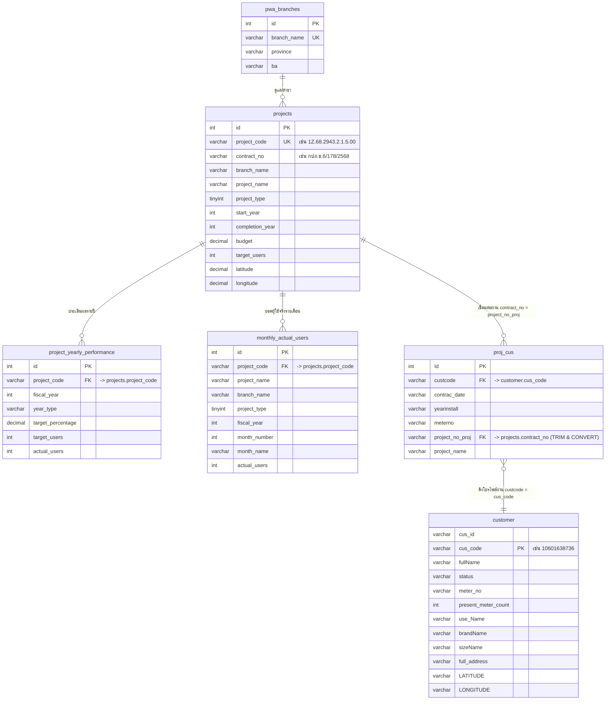

# รายละเอียดโครงสร้างตารางและความสัมพันธ์ของฐานข้อมูล (Database Schema & Relationships)

เอกสารนี้จัดทำขึ้นเพื่อบันทึกโครงสร้างฐานข้อมูล ความสัมพันธ์ของแต่ละตาราง และขั้นตอนการประมวลผลข้อมูลในระบบ เพื่อให้ผู้พัฒนาหรือผู้ดูแลระบบสามารถอ้างอิงและดำเนินการแก้ไขข้อมูลต่อได้ทันทีแม้ไม่ได้เชื่อมต่อกับผู้ช่วย AI

---

## 1. ข้อมูลฐานข้อมูลทั่วไป (Database Configuration)
* **ชื่อฐานข้อมูลหลัก:** `pcis`
* **ตัวละครหลักที่ใช้ (Charset & Collation):** `utf8mb4` คอลเลชัน `utf8mb4_unicode_ci` (เพื่อรองรับการค้นหาอักษรภาษาไทยที่ถูกต้องและหลีกเลี่ยงข้อผิดพลาด Collation Mismatch)
* **ระบบจัดการฐานข้อมูล:** MySQL / MariaDB

---

## 2. โครงสร้างแต่ละตาราง (Table Definitions)

### 2.1. ตาราง `pwa_branches` (ตารางสาขาการประปาส่วนภูมิภาค)
ใช้เก็บรายชื่อสาขาและจังหวัดของ กปภ. ขต.6
* **id** (`int`, Primary Key, Auto Increment): ไอดีประจำสาขา
* **branch_name** (`varchar(100)`, Unique): ชื่อสาขา (เช่น 'ขอนแก่น', 'บ้านไผ่')
* **province** (`varchar(100)`): จังหวัดที่สาขานั้นตั้งอยู่
* **ba** (`varchar(10)`): รหัส Business Area (BA) ของสาขา (เช่น '10601' สำหรับขอนแก่น)

### 2.2. ตาราง `projects` (ตารางโครงการขยายเขต/วางท่อ)
เก็บข้อมูลรายละเอียดหัวโครงการหลักที่ดึงมาจากแผนแม่บทหรือป้อนเข้าใหม่
* **id** (`int`, Primary Key, Auto Increment): ไอดีแถว
* **project_code** (`varchar(50)`, Unique): รหัสโครงการหลัก (เช่น `1Z.68.2943.2.1.5.00`)
* **contract_no** (`varchar(100)`): เลขที่สัญญาของโครงการ (เช่น `กปภ.ข.6/178/2568` หรือ `กปภ.ข.6-01/2564`)
* **branch_name** (`varchar(100)`): ชื่อสาขาที่รับผิดชอบโครงการ
* **project_name** (`varchar(255)`): ชื่อโครงการขยายเขต
* **project_type** (`tinyint`): ประเภทโครงการ
  * `1` = เงินรายได้ (เดิมคือ งบลงทุน)
  * `2` = เงินอุดหนุน (เดิมคือ งบอุดหนุน)
  * `3` = กระตุ้นเศรษฐกิจ (เดิมคือ งบกระตุ้นเศรษฐกิจ)
  * `4` = วางท่อเข้าซอย
* **start_year** (`int`): ปีที่เริ่มโครงการ (พ.ศ.)
* **completion_year** (`int`): ปีที่โครงการแล้วเสร็จ (พ.ศ.)
* **budget** (`decimal(15,2)`): งบประมาณโครงการ
* **target_users** (`int`): เป้าหมายจำนวนผู้ใช้น้ำ (ราย)
* **latitude** (`decimal(10,7)`): พิกัดละติจูดของโครงการ (คำนวณจากค่าเฉลี่ยพิกัดผู้ใช้น้ำ)
* **longitude** (`decimal(10,7)`): พิกัดลองจิจูดของโครงการ (คำนวณจากค่าเฉลี่ยพิกัดผู้ใช้น้ำ)

### 2.3. ตาราง `project_yearly_performance` (ตารางเป้าหมายและผลสัมฤทธิ์รายปีสะสม)
เก็บเป้าหมายรายปีสะสม และจำนวนการติดตั้งใช้งานจริงของผู้ใช้น้ำในแต่ละปีประเมิน
* **id** (`int`, Primary Key, Auto Increment): ไอดีแถว
* **project_code** (`varchar(50)`): รหัสโครงการ (เชื่อมไปยัง `projects.project_code`)
* **fiscal_year** (`int`): ปีงบประมาณการประเมิน (พ.ศ.)
* **year_type** (`varchar(20)`): ลำดับปีที่ประเมินโครงการ (`completion_year` (ปีที่แล้วเสร็จ), `year_1` (ปีที่ 1), `year_2`, `year_3`, `year_4`, `year_5_plus`)
* **target_percentage** (`decimal(5,2)`): เปอร์เซ็นต์เป้าหมายสะสมในปีนั้นๆ
  * *โครงการประเภท 1-3:* ปีที่ 0 = 40%, ปีที่ 1 = 0%, ปีที่ 2-5 = ปีละ 15%
  * *โครงการประเภท 4:* ปีที่ 0 = 100%
* **target_users** (`int`): เป้าหมายผู้ใช้น้ำสะสมในปีงบประมาณนั้นๆ (คำนวณตามสัดส่วน %)
* **actual_users** (`int`): จำนวนผู้ใช้น้ำที่เกิดขึ้นจริงในปีงบประมาณนั้น (นับจำนวนการเชื่อมสายท่อจริง)

### 2.4. ตาราง `monthly_actual_users` (ตารางรายงานผู้ใช้น้ำจริงแยกรายเดือน)
เก็บข้อมูลจำนวนผู้ใช้น้ำจริงที่เพิ่มขึ้นในแต่ละเดือนของโครงการแต่ละโครงการ
* **id** (`int`, Primary Key, Auto Increment): ไอดีแถว
* **project_code** (`varchar(50)`): รหัสโครงการ (เชื่อมไปยัง `projects.project_code`)
* **project_name** (`varchar(255)`): ชื่อโครงการ
* **branch_name** (`varchar(100)`): ชื่อสาขาที่ดูแล
* **project_type** (`tinyint`): ประเภทโครงการ (1, 2, 3, 4)
* **fiscal_year** (`int`): ปีงบประมาณ (พ.ศ.)
* **month_number** (`tinyint`): ลำดับเดือนที่ผู้ใช้น้ำเกิด (1-12)
* **month_name** (`varchar(20)`): ชื่อย่อเดือนในภาษาไทย (เช่น 'ม.ค.', 'ก.พ.')
* **actual_users** (`int`): จำนวนผู้ใช้น้ำที่ลงทะเบียนเพิ่มขึ้นในเดือนและปีนั้น

### 2.5. ตาราง `customer` (ตารางโปรไฟล์หลักของผู้ใช้น้ำจากระบบ PCIS)
เก็บรายละเอียดข้อมูลส่วนบุคคลและข้อมูลผู้ใช้น้ำ
* **cus_id** (`varchar(20)`): รหัส ID ภายใน
* **cus_code** (`varchar(20)`, Index): รหัสผู้ใช้น้ำประจำตัว (เช่น `10601638736`)
* **fullName** (`varchar(100)`): ชื่อ-นามสกุลของผู้ใช้น้ำ
* **status** (`varchar(1)`): สถานะมาตรวัดน้ำ
* **meter_no** (`varchar(50)`): หมายเลขมาตรวัดน้ำ
* **present_meter_count** (`int`): ตัวเลขการใช้มาตรน้ำปัจจุบัน
* **use_Name** (`varchar(500)`): ประเภท/ลักษณะการใช้น้ำ
* **brandName** (`varchar(50)`): ยี่ห้อมาตรวัด
* **sizeName** (`varchar(10)`): ขนาดมาตรวัดน้ำ (เช่น 1/2 นิ้ว)
* **full_address** (`varchar(500)`): ที่อยู่เต็มของผู้ใช้น้ำ
* **LATITUDE** (`varchar(20)`): พิกัดจุดผู้ใช้น้ำ (ละติจูด)
* **LONGITUDE** (`varchar(20)`): พิกัดจุดผู้ใช้น้ำ (ลองจิจูด)

### 2.6. ตาราง `proj_cus` (ตารางจับคู่ระหว่างผู้ใช้น้ำกับสัญญาโครงการ)
เชื่อมโยงรหัสผู้ใช้น้ำแต่ละคนว่าเกิดขึ้นจากสัญญาโครงการตัวใด
* **Id** (`int`, Primary Key, Auto Increment): ไอดีแถว
* **custcode** (`varchar(50)`): รหัสผู้ใช้น้ำ (เชื่อมกับ `customer.cus_code`)
* **contrac_date** (`varchar(10)`): วันที่เซ็นสัญญาติดตั้งมาตรวัด (ในรูปแบบ ดด/ปป/ปปปป)
* **yearinstall** (`varchar(5)`): ปีงบประมาณที่เข้าติดตั้ง (พ.ศ.)
* **meterno** (`varchar(20)`): เลขมาตรวัดน้ำ
* **project_no_proj** (`varchar(100)`): เลขที่สัญญาของโครงการที่ผู้ใช้น้ำรายนี้ติดตั้ง (เชื่อมกับ `projects.contract_no` หรือ `plan_master.contract_no`)
* **project_name** (`varchar(500)`): ชื่อโครงการขยายเขต

### 2.7. ตาราง `plan_master` (ตารางแม่แบบการนำเข้าแผนงานหลัก)
ตารางดิบที่นำเข้าเพื่อใช้สำหรับดึงโครงการเข้ามาสร้างลงตาราง `projects`
* **proj_no** -> เชื่อมไปยัง `projects.project_code`
* **contract_no** -> เชื่อมไปยัง `projects.contract_no`
* **branch** -> เชื่อมไปยัง `projects.branch_name`

---

## 3. แผนภาพความสัมพันธ์และการเชื่อมต่อข้อมูล (Database Entity Relationships)



---

## 4. ข้อสังเกตเชิงลึกเกี่ยวกับการดึงข้อมูล (Queries and Joins)

### 4.1. การดึงข้อมูลผู้ใช้น้ำของแต่ละโครงการ
การทำงานของ API Endpoint: `/api/project-customers/:project_code`
ระบบจะใช้คิวรีที่ทำการเชื่อมข้อมูล `proj_cus` เข้ากับ `customer` และกรองด้วย `project_code` ดังนี้:

```sql
SELECT 
  pc.custcode AS cus_code, 
  COALESCE(c.fullName, 'ไม่พบรายชื่อในฐานข้อมูล') AS fullName, 
  c.LATITUDE, 
  c.LONGITUDE, 
  COALESCE(c.full_address, 'ไม่พบที่อยู่ในฐานข้อมูล') AS full_address,
  COALESCE(c.meter_no, pc.meterno) AS meter_no,
  COALESCE(c.use_Name, '-') AS use_Name,
  COALESCE(c.brandName, '-') AS brandName,
  COALESCE(c.sizeName, '-') AS sizeName,
  COALESCE(c.present_meter_count, 0) AS present_meter_count,
  COALESCE(c.status, '-') AS status
FROM proj_cus pc
LEFT JOIN customer c ON CONVERT(pc.custcode USING utf8mb4) COLLATE utf8mb4_unicode_ci = c.cus_code
JOIN projects p ON TRIM(CONVERT(pc.project_no_proj USING utf8mb4)) COLLATE utf8mb4_unicode_ci = TRIM(p.contract_no)
WHERE p.project_code = ?;
```

---

## 5. การจัดการปัญหาข้อมูลไม่แสดงผล (Data Inconsistency / Missing Users)

### 5.1. ปัญหารายชื่อผู้ใช้น้ำในสัญญาปี 2568 ไม่แสดงผล
* **สาเหตุ:** ข้อมูลผู้ใช้น้ำรายใหม่ ๆ ได้ถูกบันทึกลงในตาราง `proj_cus` แล้วเพื่อเชื่อมโยงกับโครงการ (เช่น โครงการสัญญา 178/2568 มีจำนวน 93 ราย) แต่รายชื่อและที่อยู่ของผู้ใช้น้ำเหล่านั้น**ยังไม่ได้เพิ่มเข้าไปในตาราง `customer`** 
* **จุดสังเกต:**
  * ข้อมูลรหัสผู้ใช้น้ำล่าสุดในตาราง `customer` สิ้นสุดอยู่ที่ `10601638437`
  * แต่ข้อมูลผู้ใช้น้ำของโครงการในปี 2568 ในตาราง `proj_cus` มีรหัสวิ่งไปจนถึง `10601646966`
  * รหัสที่หายไปทั้งหมด (เช่น `10601638736` หรือรหัสที่สูงกว่า `10601638437`) จะแสดงผลเป็น **"ไม่พบรายชื่อในฐานข้อมูล"**

### 5.2. แนวทางการแก้ไขเมื่อได้รับข้อมูลอัปเดต
เมื่อได้รับตารางผู้ใช้น้ำล่าสุดจากระบบ PCIS (เช่น ไฟล์ SQL Dump ตาราง `customer` ล่าสุด):
1. นำข้อมูลไปอัปเดตลงตาราง `customer` โดยการ Import ไฟล์ SQL เพิ่มเติม หรือดำเนินการผ่านคำสั่ง SQL INSERT/REPLACE เพื่อนำรหัสผู้ใช้น้ำที่ขาดหายเข้าไปในระบบ
2. หลังจากนำเข้าแล้ว ให้ทำการรันสคริปต์ย้ายข้อมูลและคำนวณพิกัดโครงการใหม่ โดยรันคำสั่ง:
   ```bash
   cd backend
   node migrate.js
   ```
   *หมายเหตุ: คำสั่งนี้จะทำการดึงพิกัดเฉลี่ยของผู้ใช้น้ำแต่ละรายที่อยู่ในโครงการนั้น ๆ มาอัปเดตลงฟิลด์ `latitude` และ `longitude` ของตาราง `projects` ใหม่อัตโนมัติ*

---

## 6. ลำดับการประมวลผลและการอัปเดตระบบหากมีการเปลี่ยนแปลงโครงสร้าง
1. หากมีการเพิ่มคอลัมน์ใหม่ในตาราง `projects` หรือตารางผลการดำเนินงาน ให้ตรวจสอบและอัปเดตโครงสร้าง DDL ในไฟล์ `backend/seed.js` และ `backend/migrate.js` 
2. ตัวแปรสภาพแวดล้อมที่ตั้งค่าสำหรับการเชื่อมโยงฐานข้อมูลหลักจะกำหนดอยู่ในไฟล์ `backend/.env` ในหัวข้อ:
   * `DB_HOST`
   * `DB_PORT`
   * `DB_USER`
   * `DB_PASSWORD`
   * `DB_DATABASE` (ปัจจุบันกำหนดเป็น `pcis`)
